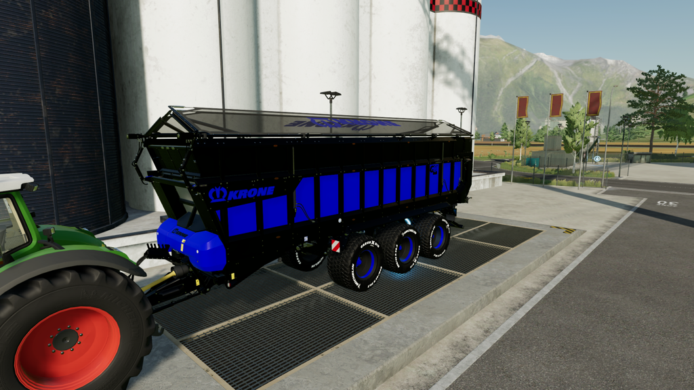

# FS22_DK_edit_KroneGX520

## *Nice pusher trailer*


This is a nice pusher trailer that can be used for a lot of products. Easy manouverable with it's steering axles.




Left view.


Left back.


Right view.


Right back


Flashers on the back that will work with beacons.


```
Original author: Giants

Contributed by: DennisK

If you distribute this mod, always include this info.

AND DO NOT UPLOAD IT TO MONATERY UPLOAD SERVICES.
THIS MOD IS AVAILABLE TO ANYONE FOR FREE AND YOU CAN USE
IT AND EDIT IT ANYWAY YOU WANT FOR PERSONAL USE.
```


## New upload 2024-02-21 (release 2.1.0)

This is a new upload and is as good as done.


## Note
Before downloading and using this mod always check the issues page. https://github.com/DennisKgaming/FS22_DK_edit_KroneGX520/issues

Sometimes issue are found and need to be solved first. Not all issues will give problems when using this mod.

## Multiplayer
Multiplayer is tested and supported.


## Guide / documentation

No special guides or documentation

Check the release page for the most recent version of this mod: https://github.com/DennisKgaming/FS22_DK_edit_KroneGX520/releases

Because GitHub has a certain way of packing a release please do the following:
- Unpack zip file
- Take out the main folder
- When in use for multiplayer: Zip the folder you took out of the zip filefolder
- Put (zip) folder in your mod directory


## Screenshots


## Additional information

Since this is a redesigned mod there is no support for console.

If you discover any issues please submit them to the issues page.